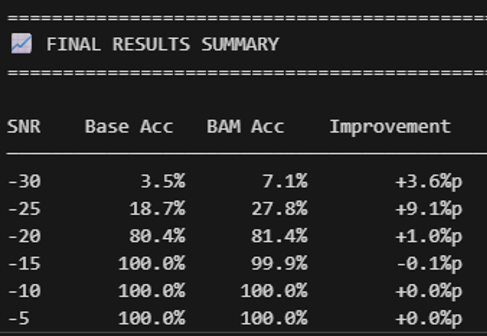
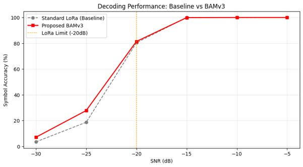
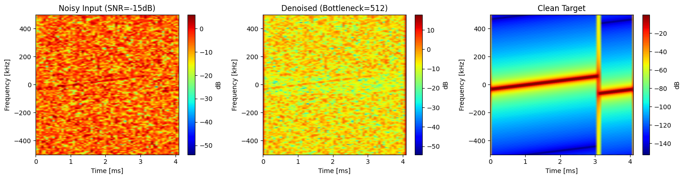
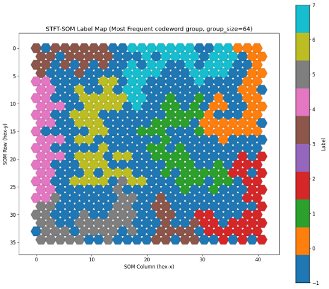

# LoRa-BAM Reconstruction

> **초저 SNR 환경에서 Complex-valued BAM으로 LoRa 신호 복원을 시도하고, 접근의 근본적 한계를 데이터 분석으로 규명한 연구**
> 2025.09 – 2026.02 · 개인 연구 / 교수 지도

---

## 1. 문제 정의

- LoRa는 CSS(Chirp Spread Spectrum) 기반 변조로, de-chirp + FFT argmax로 심볼을 복조한다.
- **초저 SNR(-25 ~ -30 dB) 구간에서는 이 기존 복조 파이프라인이 무너진다.**
- 본 연구의 목표는 **신경망 기반 신호 복원(denoising)** 을 앞단에 붙여 복조 가능한 SNR 하한을 낮출 수 있는지 검증하는 것이다.

## 2. 접근

- **Complex-valued BAM (Bidirectional Associative Memory) 설계**
  - 가중치 `W_uv`, `W_vu` 를 실제 복소수로 유지 (실수 concat 아님).
  - 활성함수는 **split-tanh** — IEEE 논문의 Lagrange 안정성 조건을 만족하도록 선택.
  - 동역학은 Euler 적분으로 forward-backward를 반복.
- **구조 실험**
  - Noise2Noise 자가지도 학습
  - 스킵 커넥션 / outer residual / tied-untied encoder 등 다수 변형
  - Complex 스펙트로그램 입력 · IQ 직접 입력 두 도메인 모두 시도

## 3. 결과 (사실만)

일부 초저 SNR 구간에서 baseline 대비 소폭 개선이 확인되었다.
그러나 **절대 성능은 실용 수준 미달**이었고, 이 지점에서 "구조를 더 바꾸는" 방향의 실험은 중단했다.

**BAMv3 (Complex Spectrogram) — 최종 결과표**



- -30 dB: 3.5% → **7.1%** (+3.6%p)
- -25 dB: 18.7% → **27.8%** (+9.1%p)
- -20 dB 이상 구간에서는 baseline이 이미 포화(≈100%)라 추가 개선 여지 없음.

**Baseline vs BAMv3 — SNR 곡선**



**복원 예시 (SNR = -15 dB, Complex spectrogram 도메인)**


좌: 노이즈 입력 (원 신호가 육안으로 식별 불가) · 중: BAM 복원 (bottleneck=512) · 우: 클린 타깃.
Chirp의 궤적은 일부 살아나지만 진폭 collapse가 남아 있고, 결정적으로 argmax bin이 흔들려 정답률 개선폭은 위 표 수준에 머문다.

## 4. 근본 원인 분석 — 왜 여기서 멈췄는가

**"구조를 더 바꾸면 될 것"이라는 결론을 내리지 않기 위해**, 모델이 아니라 **데이터 쪽을 의심하는 방향**으로 분석을 진행했다.
분석은 다음 순서로 이루어졌고, 이 순서 자체가 이 연구가 검증했던 가설의 전개이다.

1. **가설**: BAM이 학습에 실패하는 이유는 모델 구조가 아니라, 입력 신호가 심볼 간 구분 정보를 애초에 담고 있지 않기 때문이 아닌가?
2. **SOM(Self-Organizing Map)으로 심볼별 분포를 시각화**
   - **raw IQ 입력** → 심볼별 군집화 실패. 512개 심볼이 SOM 격자에 무작위로 흩어짐.
   - **대조군으로 동일 SOM에 MNIST를 입력** → 숫자별로 뚜렷하게 군집이 형성됨. (즉 SOM/파이프라인 자체는 정상)

   

   심볼을 8개의 codeword group(group_size=64)으로 묶어 SOM 격자에 매핑한 결과. 같은 label(같은 색)이 격자 위에서 **연속된 영역을 이루지 못하고 파편처럼 흩어져 있다.** 같은 실험 프로토콜을 MNIST에 적용하면 숫자별 영역이 명확히 형성되는 것과 대조적이다.
3. **거리 척도 문제인지 검증**
   - 유클리드 거리 외에 **cosine 유사도 기반 SOM**으로도 재실험 → 여전히 심볼 구분 실패.
4. **표현(feature) 문제인지 검증**
   - IQ를 **주파수/위상 불변 특징으로 변환**하여 재입력 → 여전히 군집화 실패.
5. **결론**:
   > 초저 SNR 구간의 LoRa IQ 신호는 **심볼을 구분할 정보 자체를 (거리·유사도 관점에서) 충분히 담고 있지 않다.**
   > 이는 거리 척도의 문제도, 모델 구조의 문제도 아닌 **입력 신호의 정보량 한계**이다.
   > BAM처럼 associative memory 관점의 모델은 "가까운 것을 같은 클래스로 묶는" 원리에 의존하는데, 애초에 그 "가까움"이 클래스와 정렬되지 않는다.

## 5. 결론 및 의의

- 본 연구는 목표 성능(초저 SNR에서 baseline을 유의미하게 상회)에 도달하지 못했다.
- 그러나 실패의 원인을 "모델 탓"으로 남기지 않고 **데이터 수준에서 규명**했다.
- 초저 SNR LoRa 신호 복원에 **거리/유사도 기반(associative memory 계열) 접근**을 적용할 때의 정보 이론적 한계를 확인했으며, 이는 동일 접근을 시도할 후속 연구가 피해야 할 경로를 명시한다.
- 후속 연구의 방향으로는 (a) 거리 기반이 아닌 **채널/코딩 사전정보를 활용한 posterior 추정**, (b) **다중 심볼/시계열 컨텍스트**를 함께 보는 sequence 모델이 더 유망하다고 판단한다.

---

## 폴더 구성

폴더는 **실험 시간 순**으로 번호가 매겨져 있으며, 이름에 그 시점의 접근이 드러난다.
`01 → 07` 순서로 읽으면 위 3~4장 서사의 실제 코드 궤적을 그대로 따라갈 수 있다.

```
LoRa-bam-reconstruction/
├── utils/                                 # 공용: LoRa 클래스, BAM 구현, 심볼 추정
├── 01_baseline_stft-magnitude-bam/        # STFT magnitude(dB) + MultiBAM
├── 02_bam-v3_complex-spectrogram/         # Complex 스펙트로그램 + MultiBAMv3
├── 03_bam-v4_tied-autoencoder/            # Tied AE 구조
├── 04_bam-v5_untied-residual-huber/       # Untied + outer residual + Huber
├── 05_bam-v6_residual-fc-blocks/          # Residual FC block 스택
├── 06_bam_complex-iq-direct/              # 단층 Complex-Valued BAM (IQ 직접 입력)
├── 07_noise2noise/                        # Noise2Noise 학습 (최종 결과)
├── simulation_theory/                     # 복소수 활성함수(modReLU, zReLU) 시각화
└── local/                                 # README용 결과 이미지
```

공통 설정: SF = 9 (심볼 512개), fs = 1 MHz, 노이즈는 AWGN.

### 01_baseline_stft-magnitude-bam/ — 실수 도메인 baseline
- IQ → STFT → BW crop → **magnitude(dB) / magnitude flatten** 위에서 BAM 학습.
- 결과: 모든 SNR에서 baseline과 동률 또는 낮음. Complex 정보 소실이 원인으로 추정 → 다음 폴더에서 complex 도메인으로 이동.

### 02_bam-v3_complex-spectrogram/ — Complex 스펙트로그램 진입
- Complex STFT (real/imag concat 7936-dim) + `MultiBAMv3` (Torch, identity 활성, target-driven W 갱신, weight decay + grad clip).
- BW = 250 kHz, OSF = 4.
- **출력 collapse 관측** — 입력이 달라져도 출력이 상수 근처로 수렴, 정답률 0.0~0.4%.

### 03_bam-v4_tied-autoencoder/ — Tied AE로 재파라미터화
- `W_dec = W_enc^T` 로 묶고 leaky_relu + MSE + Adam.
- 같은 collapse 재현. **단일 심볼 디버깅에서 복원 peak이 clean 대비 0.2% 수준** → 진폭 붕괴가 학습 목적함수 수준의 문제임을 확인.

### 04_bam-v5_untied-residual-huber/ — Outer residual + Huber
- `x + α·δ` outer residual과 Huber loss로 collapse 방지.
- collapse는 해결. 그러나 모든 SNR에서 baseline보다 낮음 (예: -20 dB baseline 99.4% vs BAM 74.1%).

### 05_bam-v6_residual-fc-blocks/ — 깊이 확장
- Encoder/decoder를 `ResidualFCBlock` 스택으로 확장, `residual_alpha` epoch 스케줄.
- baseline과 거의 동률. 깊이만 늘려서는 개선되지 않음이 확인됨 → **여기서 "구조 실험" 라인 중단.**

### 06_bam_complex-iq-direct/ — 도메인 축소 (스펙트로그램 → IQ)
- 단층 **Complex-Valued BAM** (`ComplexIQBAM`). split-tanh + gain clamp + anchor.
- IQ를 직접 입력받아 dv/dt·du/dt Euler 동역학으로 복원.
- Complex-valued 가중치 자체의 표현력이 문제인지 검증하기 위한 축소 실험.

### 07_noise2noise/ — 최종 결과가 나온 지점
- 02와 동일 파이프라인(Complex 스펙트로그램 + `MultiBAMv3`)을 **Noise2Noise 자가지도**로 재학습.
- 아키텍처는 2-layer로 단축 (7936 → 2048 → 512), 학습 SNR U(-7.5, 0), 30 epochs.
- **§3의 결과표/그래프가 이 실험에서 나온 것.**
- 이후 이 결과의 개선 상한을 이해하기 위해 §4의 SOM 분석으로 넘어감.

### simulation_theory/
- modReLU, zReLU 복소수 활성함수의 magnitude/phase 시각화. 활성함수 선택의 근거로 사용.

### utils/
- `LoRa.py` — LoRa 심볼 생성/AWGN + BAM 계열 전 구현 (`BAM`, `MultiBAM`, `BAMv3`, `BAMv3_Huber`, `BAMv4`, `MultiBAMv5`, `MultiBAMv6`, `ComplexIQBAM`).
- `my_lora_utils.py` — `estimate_symbol_custom(a, sf, fs, bw)`: dechirp + FFT + **OSF-fold power 합산** 후 argmax.

## 부록 — 핵심 함수

원본 디코딩 코드에는 `power[:2^sf]` 로 앞 bin만 잘라 보는 오류가 있어 **OSF>1일 때 FFT power의 OSF-fold 합산이 누락**되어 있었다. 아래 함수는 이를 수정한 것으로, 모든 실험의 baseline·평가 파이프라인이 이 함수를 공유한다.

```python
def estimate_symbol_custom(a, sf, fs, bw):
    # 1. signal_len 을 2^sf 정수배로 잘라 맞춤
    # 2. osf = signal_len // 2^sf
    # 3. down-chirp 생성 후 dechirp
    # 4. FFT → power = |spectrum|^2
    # 5. osf > 1 이면 power.reshape(osf, 2^sf).sum(axis=0) 로 OSF-fold 합산
    # 6. argmax → symbol index
```
